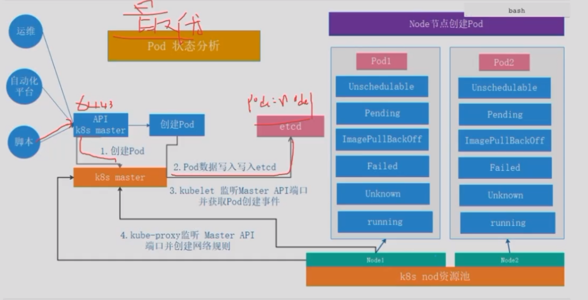

# 1、Pod 状态和探针：


以后再补图片

## 1.1、pod 状态

[Pod 的生命周期：container-states | Kubernetes](https://kubernetes.io/zh/docs/concepts/workloads/pods/pod-lifecycle/#container-states)

### 第一阶段

```bash
Pending
# 正在创建 pod 但是 pod 中的容器还没有全部被创建完成。处于此状态的 pod 应该检查 pod 依赖的存储是否有挂载权限、镜像是否可以下载、调度是否正常等。

Failed
# pod 中有容器启动失败而导致 pod 工作异常。

Unknown
# 由于某种原因无法获得 pod 的当前状态，**通常是由于与 pod 所在的 node 节点通信错误。**

Succeeded
# pod 中的所有容器都被成功终止，即 pod 里所有的 containers 均已 terminated。
```

### 第二阶段

```bash
Unschedulable
# pod 不能被调度，kube-scheduler 没有匹配到合适的 node 节点。

PodScheduled
# pod 正处于调度中，在 kube-scheduler 刚开始调度的时候，还没有将 pod 分配到指定的 node，在筛选出合适的节点后就会更新 etcd 数据，将 pod 分配到指定的 node。

Initialized
# 所有 pod 中的初始化容器已经完成了。

ImagePullBackOff
# pod 所在的 node 节点下载镜像失败。

Running
# pod 内部的容器已经创建并且启动。

Ready
# 表示 pod 中的容器已经可以提供访问服务。
```



以后再补图片

```BASH
Error：						# pod 启动过程中发生错误
NodeLost：					# pod 所在节点失联
Unknown：					# pod 所在节点失联或其他未知异常
Waiting：					# pod 等待启动
Pending：					# pod 等待被调度
Terminating：				# pod 正在被销毁
CrashLoopBackOff：			# pod 无响应或探针检测失败，kubelet 正在将他重启。
InvalidImageName：			# node 节点无法解析镜像名称导致的镜像无法下载
ImageInspectError：			# 无法校验镜像，镜像不完整导致
ErrImageNeverPull：			# 策略禁止拉取镜像，镜像中心权限是私有等
ImagePullBackOff：			# 镜像拉取失败，但是正在重新拉取
RegistryUnavailable：		# 镜像服务器不可用，网络原因或 harbor 宕机
ErrImagePullBackOff：		# 镜像拉取出错，超时或下载呗强制终止
CreateContainerConfigError：	# 不能创建 kubelet 使用的容器配置
CreateContainer：			# 创建容器失败
PreStartContainer：			# 执行 preStart hook 报错，pod hook （钩子）是由 Kubernetes 管理的 kubelet 发起的，当容器中的进程启动前或者容器中的进程终止前运行，比如容器创建完成后里面的服务启动之前可以检查一下依赖的其他服务是否启动，或者容器退出之前可以把容器中的服务先通过命令停止。
PostStartHookError：			# 执行 postStart hook 报错。

RunContainerError：			# pod 运行失败，容器中没有初始化 PID 为 1 的守护进程等。
ContainersNotInitialized：	# pod 没有初始化完毕。
ContainersNotReady：			# pod 没有准备完毕。
ContainerCreating：			# pod 正在创建中。
PodInitializing：			# pod 正在初始化中。
DockerDaemonNotReady：		# node 节点 docker 服务没有启动。
NetworkPlginNotReady：		# 网络插件还没有完全启动。
```

## 1.2、pod 调度过程

见实战 2.1.3 ： kube-scheduler

## 1.3、pod 探针

[Pod 的生命周期 | Kubernetes](https://kubernetes.io/zh/docs/concepts/workloads/pods/pod-lifecycle/#container-probes)

### 1.3.1、探针简介

[Probe](https://kubernetes.io/docs/reference/generated/kubernetes-api/v1.23/#probe-v1-core) 是由 [kubelet](https://kubernetes.io/zh/docs/reference/command-line-tools-reference/kubelet/) 对容器执行的定期诊断。 要执行诊断，kubelet 调用由容器实现的 [Handler](https://kubernetes.io/docs/reference/generated/kubernetes-api/v1.23/#handler-v1-core) （处理程序）。有三种类型的处理程序：

[ExecAction](https://kubernetes.io/docs/reference/generated/kubernetes-api/v1.23/#execaction-v1-core)  、 [TCPSocketAction](https://kubernetes.io/docs/reference/generated/kubernetes-api/v1.23/#tcpsocketaction-v1-core)  、[HTTPGetAction](https://kubernetes.io/docs/reference/generated/kubernetes-api/v1.23/#httpgetaction-v1-core)

```bash
ExecAction： 	# 在容器内执行指定命令。如果命令退出时返回码为 0 则认为诊断成功。

TCPSocketAction：# 对容器的 IP 地址上的指定端口执行 TCP 检查。如果端口打开，则诊断被认为是成功的。

HTTPGetAction： 	# 对容器的 IP 地址上指定端口和路径执行 HTTP Get 请求。如果响应的状态码大于等于 200 且小于 400，则诊断被认为是成功的。
```

每次探测都将获得以下三种结果之一：

```bash
`Success（成功）`	# 容器通过了诊断。
`Failure（失败）`	# 容器未通过诊断。
`Unknown（未知）`	# 诊断失败，因此不会采取任何行动。
```

### 1.3.2、 配置探针

基于探针实现对 pod 的状态检测

#### 1.3.2.1、探针类型

针对运行中的容器，kubelet 可以选择是否执行以下三种探针，以及如何针对探测结果作出反应：

```bash
livenessProbe
# 指示容器是否正在运行。如果存活态探测失败，则 kubelet 会杀死容器， 并且容器将根据其重启策略决定未来。如果容器不提供存活探针， 则默认状态为 Success。

readinessProbe
# 指示容器是否准备好为请求提供服务。如果就绪态探测失败， 端点控制器将从与 Pod 匹配的所有服务的端点列表中删除该 Pod 的 IP 地址。 初始延迟之前的就绪态的状态值默认为 Failure。 如果容器不提供就绪态探针，则默认状态为 Success。

startupProbe
# 指示容器中的应用是否已经启动。如果提供了启动探针，则所有其他探针都会被禁用，直到此探针成功为止。如果启动探测失败，kubelet 将杀死容器，而容器依其 重启策略进行重启。 如果容器没有提供启动探测，则默认状态为 Success。
```

#### 1.3.2.2、探针配置

[配置存活、就绪和启动探测器 | Kubernetes](https://kubernetes.io/zh/docs/tasks/configure-pod-container/configure-liveness-readiness-startup-probes/)

[Probe](https://kubernetes.io/docs/reference/generated/kubernetes-api/v1.23/#probe-v1-core) 有很多配置字段，可以使用这些字段精确的控制存活和就绪检测的行为：

```bash
`initialDelaySeconds`
# 容器启动后要等待多少秒后存活和就绪探测器才被初始化，默认是 0 秒，最小值是 0。建议 5-10秒、100-120秒，具体看应用和场景实测。
# ps：pod 启动后默认立即进行存活检查和就绪检查，如果应用启动很慢则会失败。

`periodSeconds`
# 执行探测的时间间隔（单位是秒）。默认是 10 秒。最小值是 1。

`timeoutSeconds`
#单次探测超市时间 探测的超时后等待多少秒。默认值是 1 秒。最小值是 1。

`successThreshold`
# 从失败转为成功的重试次数，探测器在失败后，被视为成功的最小连续成功数。默认值是 1。 存活和启动探测的这个值必须是 1。最小值是 1。

`failureThreshold`
# 从成功转为失败的重试次数，当探测失败时，Kubernetes 的重试次数。 存活探测情况下的放弃就意味着重新启动容器。 就绪探测情况下的放弃 Pod 会被打上未就绪的标签。默认值是 3。最小值是 1。
```

##### HTTP 探测 

[HTTP Probes](https://kubernetes.io/docs/reference/generated/kubernetes-api/v1.23/#httpgetaction-v1-core) 可以在 `httpGet` 上配置额外的字段：

```bash
host
# 连接使用的主机名，默认是 Pod 的 IP。也可以在 HTTP 头中设置 “Host” 来代替。

scheme: http
# 用于设置连接主机的方式（HTTP 还是 HTTPS）。默认是 HTTP。

path
# 访问 HTTP 服务的路径。默认值为 "/"。

httpHeaders
# 请求中自定义的 HTTP 头。HTTP 头字段允许重复。

port
# 访问容器的端口号或者端口名。如果数字必须在 1 ～ 65535 之间。
```

简短示例，更多可看官方文档

```yaml
apiVersion: v1
kind: Pod
metadata:
  labels:
    test: liveness
  name: liveness-exec
spec:
  containers:
  - name: liveness
    image: k8s.gcr.io/busybox
    args:
    - /bin/sh
    - -c
    - touch /tmp/healthy; sleep 30; rm -rf /tmp/healthy; sleep 600

	# 多种探测使用一种或组合均可
    # 命令检查
    livenessProbe:
      exec:
        command:
        - cat
        - /tmp/healthy
      initialDelaySeconds: 5
      periodSeconds: 5

    # URL检查
    livenessProbe:
      httpGet:
        path: /healthz
        port: 8080
        httpHeaders:
        - name: Custom-Header
          value: Awesome
      initialDelaySeconds: 3
      periodSeconds: 3

	# 端口检查
    readinessProbe:
      tcpSocket:
        port: 8080
      initialDelaySeconds: 5
      periodSeconds: 10
    livenessProbe:
      tcpSocket:
        port: 8080
      initialDelaySeconds: 15
      periodSeconds: 20
```

#### 1.3.2.3、linenessProbe 和 readinessProbe 的对比

```bash
配置参数一样
liveness	# 连续探测失败会重启、重建 pod，readinessProbe 不会执行重启或者重建 pod 操作
liveness	# 连续探测指定次数失败后会将容器置于（Crash Loop backOff）且不可用，readinessProbe 不会
readiness	# 连续探测失败会从 service 的 endpoint 中删除该 pod，livenessProbe 不具备此功能，但是会将容器挂起 LivenessProbe
liveness	# 用户控制是否重启 pod，readinessProbe 用于控制 pod 是否添加至service。

建议：
	两个探针都配置
```


## 1.4、pod 重启策略

Pod 的 `spec` 中包含一个 `restartPolicy` 字段，其可能取值包括 Always、OnFailure 和 Never。默认值是 Always。

```bash
restartPolicy：
	Always：		当容器异常时，k8s 自动重启该容器，ReplicationController/Replicaset/Deployment。
	OnFailure：	当容器启动失败时（容器停止运行且退出码不为 0 ），k8s 自动启动该容器。
	Never：		不论容器运行状态如何都不会重启该容器，Job 或 CronJob。
```

`restartPolicy` 适用于 Pod 中的所有容器。`restartPolicy` 仅针对同一节点上 `kubelet` 的容器重启动作。当 Pod 中的容器退出时，`kubelet` 会按指数回退 方式计算重启的延迟（10s、20s、40s、...），其最长延迟为 5 分钟。 一旦某容器执行了 10 分钟并且没有出现问题，`kubelet` 对该容器的重启回退计时器执行 重置操作。


