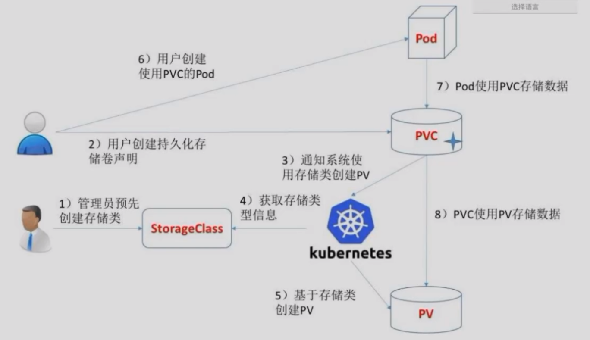

# PV 与 PVC 

默认情况下容器中的磁盘文件是非持久化的，对于运行在容器中的应用来说面临两个问题，

> 第一：当容器挂掉 kubelet 将重新启动它时，文件将会丢失；
>
> 第二：当 pod 中同时运行多个容器，容器之间需要共享文件

 Kubernetes 的 volume 解决了这两个问题。

https://kubernetes.io/zh/docs/concepts/storage

```bash
# https://kubernetes.io/zh/docs/concepts/storage/persistent-volumes/
持久卷（PersistentVolume，PV）是集群中的一块存储，可以由管理员事先供应，或者 使用存储类（Storage Class）来动态供应。 持久卷是集群资源，就像节点也是集群资源一样。PV 持久卷和普通的 Volume 一样，也是使用 卷插件来实现的，只是它们拥有独立于任何使用 PV 的 Pod 的生命周期。 此 API 对象中记述了存储的实现细节，无论其背后是 NFS、iSCSI 还是特定于云平台的存储系统。

持久卷申领（PersistentVolumeClaim，PVC）表达的是用户对存储的请求。概念上与 Pod 类似。 Pod 会耗用节点资源，而 PVC 申领会耗用 PV 资源。Pod 可以请求特定数量的资源（CPU 和内存）；同样 PVC 申领也可以请求特定的大小和访问模式 （例如，可以要求 PV 卷能够以 ReadWriteOnce、ReadOnlyMany 或 ReadWriteMany 模式之一来挂载，参见访问模式）。

尽管 PersistentVolumeClaim 允许用户消耗抽象的存储资源，常见的情况是针对不同的 问题用户需要的是具有不同属性（如，性能）的 PersistentVolume 卷。 集群管理员需要能够提供不同性质的 PersistentVolume，并且这些 PV 卷之间的差别不 仅限于卷大小和访问模式，同时又不能将卷是如何实现的这些细节暴露给用户。 为了满足这类需求，就有了 存储类（StorageClass） 资源。
```

请求流程：图片以后再补



PersistentVolume 参数：

```bash
# kubectl explain PersistentVolume /pv

# https://kubernetes.io/docs/concepts/storage/persistent-volumes/#capacity
Capacity:					# 当前 PV 空间大小	# kubectl explain pv.spec.capacity

# https://kubernetes.io/zh/docs/concepts/storage/persistent-volumes/#volume-mode
volumeMode					# 卷类型			  # kubectl explain pv.spec.volumeMode
	针对 PV 持久卷，Kubernetes 支持两种卷模式（volumeModes）：
		Filesystem（文件系统） 和 Block（块）。 
		volumeMode 是一个可选的 API 参数。 如果该参数被省略，默认的卷模式是 Filesystem。

# https://kubernetes.io/zh/docs/concepts/storage/persistent-volumes/#access-modes
accessModes:				# 访问模式，			 # kubectl explain pv.spec.accessModes
	ReadWriteOnce - RWO:	# 卷可以被一个节点以读写方式挂载。 ReadWriteOnce 访问模式也允许运行在同一节点上的多个 Pod 访问卷。
	ReadOnlyMany  - ROX:	# 卷可以被多个节点以只读方式挂载。
	ReadWriteMany - RWX:	# 卷可以被多个节点以读写方式挂载。
	ReadWriteOncePod:		# 卷可以被单个 Pod 以读写方式挂载。 
							# 如果你想确保整个集群中只有一个 Pod 可以读取或写入该 PVC， 请使用ReadWriteOncePod 访问模式。
							# 这只支持 CSI 卷以及需要 Kubernetes 1.22 以上版本。
							
persistentVolumeReclaimPolicy:	# 删除机制，即删除存储卷时候，已经创建好的存储卷有以下删除操作：
	# kubectl explain pv.spec.persistentVolumeReclaimPolicy
    Retain  -- # 手动回收；删除 PV 后保持原存储，最后由管理员手动删除
    Recycle -- # 基本擦除 (rm -rf /thevolume/*)；目前仅支持 NFS 和 HostPath 。
    Delete  -- # 诸如 AWS EBS、GCE PD、Azure Disk 或 OpenStack Cinder 卷这类关联存储资产都会被自动删除。
	# 目前，仅 NFS 和 HostPath 支持回收（Recycle）。 AWS EBS、GCE PD、Azure Disk 和 Cinder 卷都支持删除（Delete）。

```


