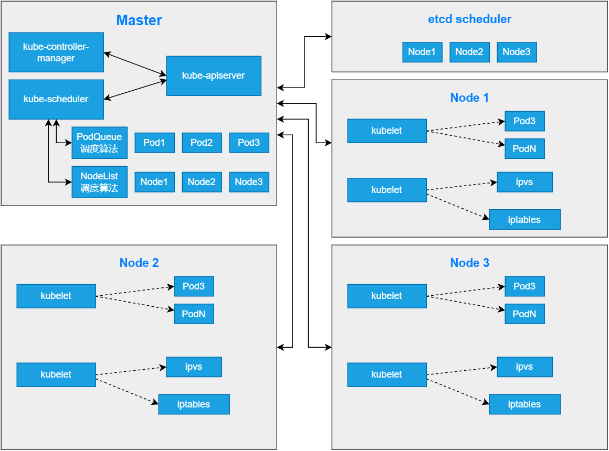
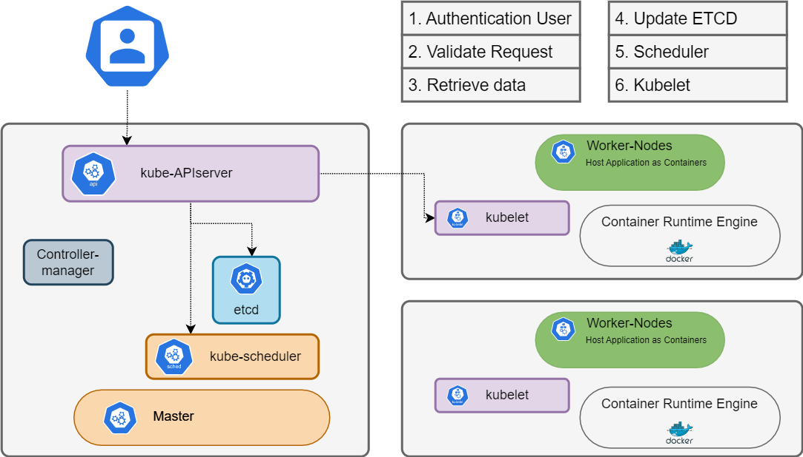

# kube-scheduler 简介

通过调度算法为待调度Pod列表的每个Pod从可用Node列表中选择一个最适合的Node，并将信息写人etcd中

node节点上的 kubelet 通过 API Server 监听到 Kubernetes Scheduler 产生的Pod绑定信息，然后获取对应的 Pod 清单，下载 Image，并启动容器。

```tex
策略：
LeastRequestedPriority：		优先从备选节点列表中选择资源消耗最小的节点（CPU+内存）
CalculateNodeLabelPriority： 优先选择含有指定Label的节点。
BalancedResourceAllocation：	优先从备选节点列表中选择各项资源使用率最均衡的节点。

1.先排除不符合条件的节点
2.在剩余的可用选出一个最符合条件的节点
3.启动一个pod后，先将数据写入到etcd后再启动下一个pod （一个一个调度）
```



**scheduler 调度过程**



