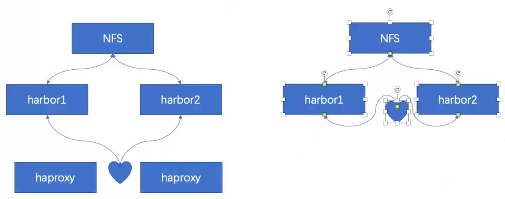
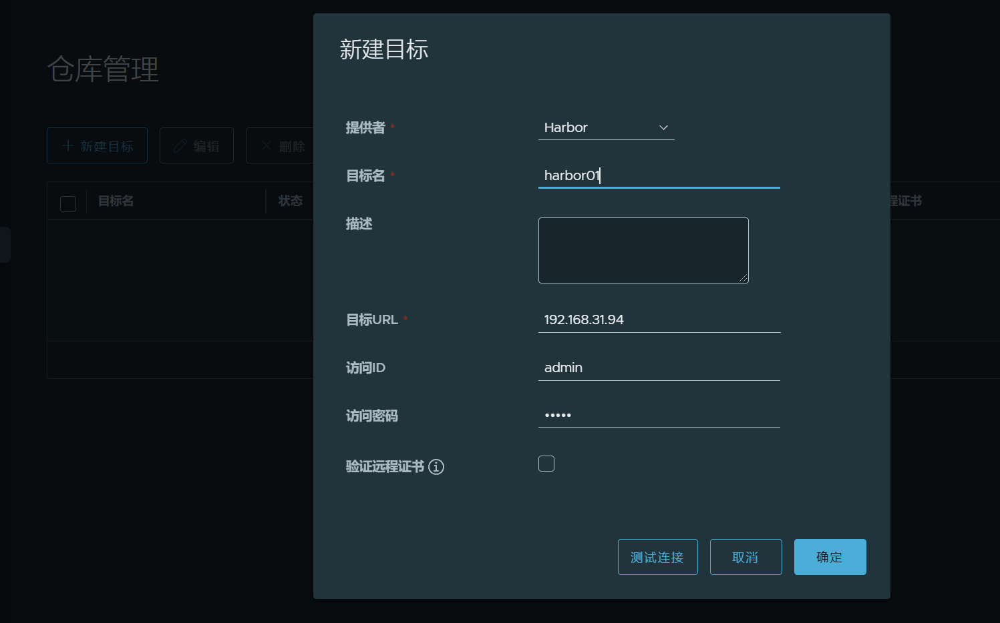
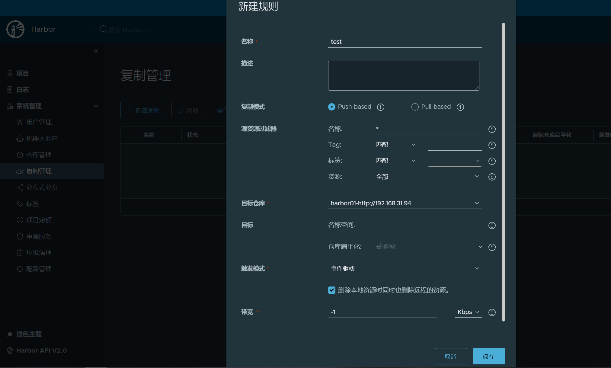

<!--
 * @Description:
 * @Author: 焦国峰
 * @Github: https://github.com/clement-jiao
 * @Date: 2022-01-08 17:56:44
 * @LastEditors: clement-jiao
 * @LastEditTime: 2022-01-08 18:03:59
-->
## 关于 harbor 高可用的思路
Harbor高可用官方只提供了一种，就是 harbor 服务器之间通过同步的镜像的方式。比如 harbor A 有新的 image 会自动同步给 harbor B，在 harbor B 上传的镜像也同样会同步给 harbor A。这种方式在底层数据库及存储是相互独立的，只是把 docker image 同步过去。

除了镜像同步，harbor 还可以使用共享数据库及存储的方式同步。



### 通过镜像同步的方式
1.选择 `仓库管理`，`新建目标` harbor仓库及用户密码，点击确定，如果不能连接会报错，记得去掉验证远程证书的勾选。



2.上一步目标仓库设置好了，接下来设置 `复制管理`，就是设置同步



### haproxy
在haproxy加入两个harbor

```bash
root@debian:~$ vim /etc/haproxy/haproxy.cfg
...
listen harbor
  bind 192.168.31.111:80		# 注意要有VIP，不然无法访问
  mode tcp
  balance source
  server harbor01 192.168.31.94:80 check inter 3s fall 3 rise 5
  server harbor02 192.168.31.79:80 check inter 3s fall 3 rise 5
```

#### 绑定非本机ip

如果 haproxy 重启提示：cannot bind socket 。

报错信息：[ALERT] 066/104255 (10558) : Starting frontend http-in: cannot bind socket

**则绑定非本机的IP需要在 sysctl.conf 文件中配置： net.ipv4.ip_nonlocal_bind=1**

```bash
root@debian:~$ vim /etc/sysctl.conf
添加：net.ipv4.ip_nonlocal_bind=1
sysctl -p
```


### 参考资料

[Harbor高可用方案](https://blog.csdn.net/tom_fans/article/details/107556170)

[goharbor/harbor:(github.com)](https://github.com/goharbor/harbor)
