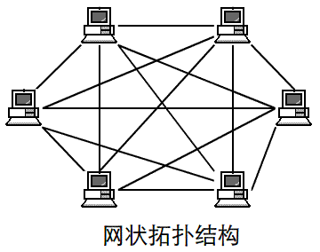
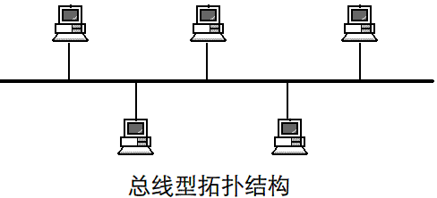
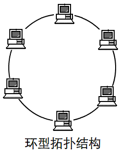
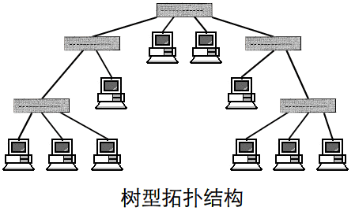
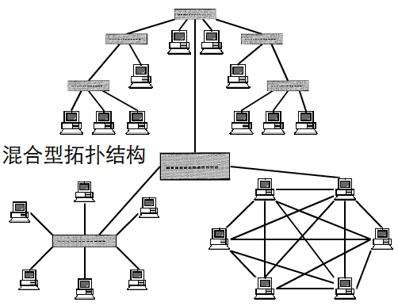

## 网络基础

### 1.网络协议与标准
- 协议
  1. 语义
  2. 语法
  3. 同步

- 同步
  1. **ISO:**   国际化标准组织
  2. **ANSI:**  美国国家标准化局
  3. **ITU-T:** 国际电信联盟
  3. **IEEE:**  电气和电子工程师学会

------------------------------------------------------------
### 2. WAN 与 LAN
- WAN
  使用外网 ip 通信的网络属于 WAN （广域网）

- LAN
  使用内网 ip 通信的网络属于 LAN （局域网）

------------------------------------------------------------
### 3. IEEE 802 局域网标准
- IEEE 802.3 (有线网络)
  IEEE 802.3u标准：百兆快速以太网标准
  IEEE 802.3z标准：光纤介质实现千兆以太网标准
  IEEE 802.3ab标准：双绞线实现千兆以太网标准
  IEEE 802.3ae标准：光纤介质实现万兆以太网标准
  IEEE 802.3an标准：双绞线实现万兆以太网标准
- IEEE 802.11 (无线网络)
  IEEE 802.11a：载波频率5GHz，速率最高可达54Mbps
  IEEE 802.11b：载波频率2.4GHz，速率最高可达11Mbps
  IEEE 802.11g：载波频率2.4GHz，速率最高可达54Mbps

------------------------------------------------------------
### 4. 七种网络拓扑结构
- 星型拓扑

>星型拓扑结构是一个中心，多个分节点。它结构简单，连接方便，管理和维护都相对容易，而且扩展性强。网络延迟时间较小，传输误差低。中心无故障，一般网络没问题。中心故障，网络就出问题，同时共享能力差，通信线路利用率不高。

- 网型拓扑

>网形拓扑结构是应用最广泛的，它的优点是不受瓶颈问题和失效问题的影响，一天线路出问题，可以做其他线路，但太复杂，成本高。

- 总线拓扑

>总线拓扑结构所有设备连接到一条连接介质上。总线结构所需要的电缆数量少，线缆长度短，易于布线和维护。多个结点共用一条传输信道，信道利用率高。但不找诊断故障。

- 环形拓扑

>环形拓扑结构是节点形成一个闭合环。工作站少，节约设备。当然，这样就导致一个节点出问题，网络就会出问题，而且不好诊断故障。

- 树形拓扑

>树形拓扑结构从总线拓扑演变而来。形状像一棵倒置的树, 顶端是树根，树根以下带分支，每个分支还可再带子分支，树根接收各站点发送的数据，然后再广播发送到全网。好扩展，容易诊断错误，但对根部要求高。

- 混合型拓扑

>混合式拓扑结构是将上面两种或多种共同使用。如用的多有星总线型、星环型等。

- 蜂窝拓扑

>蜂窝拓扑结构是无线局域网中常用的结构。它以无线传输介质（微波、卫星、红外等）点到点和多点传输为特征，是一种无线网，适用于城市网、校园网、企业网。

------------------------------------------------------------
### 5. 计算机数值
- 十进制数制系统
  十进制数制系统包括10个数字：
    0 1 2 3 4 5 6 7 8 9

- 二进制数制系统
  二进制这个词的意思是基于两个数字：
  这些二进制数或二进制位表示位 0 和 1
    0 1

- 十六进制数系统
  十六进制数制系统的基数是16：
    0 1 2 3 4 5 6 7 8 9 A B C D E F

- 数制的表示
  十进制数(*Decimal Number
  $(1010)_{10}，1010D，1010$
  二进制数(*Birnay Number
  $(1010)_2,1010B$
  十六进制数(*Hexadecimal number
  $(1010)_{16},1010H$

- 二进制转换
  二进制转换十进制
  $125=1\times2^6+1\times2^5+1\times2^4+1\times2^3+1\times2^2+0\times2^1+1\times2^0$
  $125=0111 1101b$

- 装水桶法（用于心算ip）
  每个 ip 有32位，每8位为一组，将这8位数的数值写出
  | 1 | 1 | 1 | 1 | 1 | 1 | 1 | 1 |
  | :--: | :--: | :--: | :--: | :--: | :--: | :--: | :--: |
  | 128 | 64 | 32 | 16 | 8 | 4 | 2 | 1 |
  >如果现在有一个网段，需要将十进制转换为二进制，对照上方的表格，从左到右依次做减法，上方表格中的十进制数作为被减数，网段作为减数。若减数大于被减数，这个被减数对应的二进制数位为 1，若减数小于被减数，则这个被减数对应的二进制数位为 0，并跳过这一位，向下做减法。

  举例：
  $204-128=76-64=10-8=2-2=0$

对照表格得出:
| 1 | 1 | 1 | 1 | 1 | 1 | 1 | 1 |
| :--: | :--: | :--: | :--: | :--: | :--: | :--: | :--: |
| 128 | 64 | 32 | 16 | 8 | 4 | 2 | 1 |
| 1 | 1 | 0 | 0 | 1 | 0 | 1 | 0 |
所以这个网段转换成二进制数是 1100 1010B。
- 十六进制转换十进制的快速算法
  >一个十六进制数最高位是 **F**，也就是15.而4个二进制数的总和正好等于15。所以__每个十六进制数可以用4个二进制数来表示__。然后在使用二进制转换为十进制。

  举例：
    $(FA)_{16}$ F=1111 &nbsp; A=1010
    $(FA)_{16}=11111010B=240$
- 储存量
  >计算机的储存量可以用位和字节来表示

  |8bit（位）|1byts（字节）|
  | :---: | :--: |
  |1024byts|1KB|
  |1024KB  |1MB|
  |1024MB  |1GB|
  |1024GB  |1TB|
  |1024TB  |1EB|
  |1024EB  |1PB|
  |1024PB  |1ZB|
