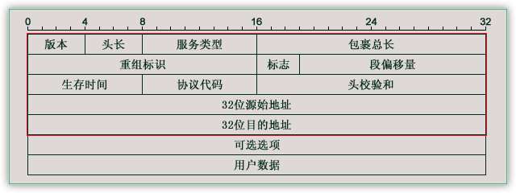
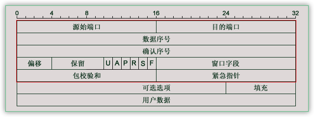
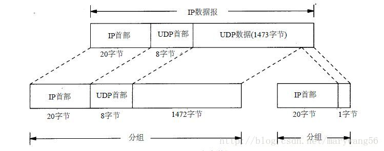
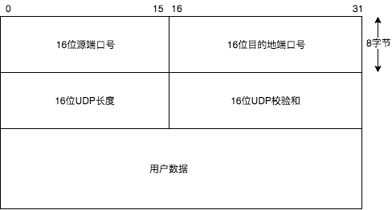

#网通信协议

##1.广播与广播域概述
- 广播：将广播地址作为目的地址的数据帧
- 广播域：网络中能接收到同一个广播所有节点的集合
  >接收同样广播消息的节点的集合。如：在该集合中的任何一个节点传输一个广播帧，则所有其他能收到这个帧的节点都被认为是该广播帧的一部分。由于许多设备都极易产生广播，所以如果不维护，就会消耗大量的带宽，降低网络的效率。由于广播域被认为是OSI中的第二层概念，所以像Hub，交换机等第一，第二层设备连接的节点被认为都是在同一个广播域。而路由器，第三层交换机则可以划分广播域，即可以连接不同的广播域。
- MAC地址广播：广播地址为FF-FF-FF-FF-FF-FF
- IP广播地址：广播IP地址为IP地址网段的广播地址

##2.IP协议
###IP地址
>主机唯一标示，保证主机间的正常通讯的一种网络编码，用来确定网络中一个节点。
IP地址由32位二进制数组成，为了便于记忆，将32位二进制数划分为每八位一组，再将每八位转换为十进制。
例如：
$(11010010.01001001.10001100.00000110)_2$$\Rightarrow$$210.73.140.6$

###IP地址的组成
- IP地址由两部分组成
网络部分(Network)
主机部分(Host)
`192.168.0. ——  25`
网络部分 — 主机部分

###IP地址的分类
IP地址分为A、B、C、D、E五类，每一类有不同划分规则
IP地址跟A、B、C、D、E分类没有任何关系，原因是子网掩码，IP地址的主机位和网络位依靠子网掩码划分。
- **A类地址**
>前八位第一位必须为 **0**，所以A类地址的范围就是`0000 0000 到 0111 1111`，因此换为十进制就是`0 ~ 127`。**但是127网段中127.0.0.1是本地回环网卡，整个网段都被占用。**

子网掩码：`255.0.0.0`
最大网段数：$2^7-2$ = 126个
最大主机数：$2^{24}-2=16777216-2=16777214$

全 0 全 1 的地址不可分配，作为保留地址。 上面减2也是这个原因。
一般用于大型网络。

- **B类地址**
>前八位的前两位必须是 **10**，所以B类地址的范围就是`1000 0000 到 1011 1111`,因此转换为十进制就是`128 ~ 191`。

子网掩码：`255.255.0.0`
最大网段数：$2^{14}=16384$
最大主机数：$2^{16}-2=65536-2=65534$

- **C类地址**
>前八位的前三位必是**110**，所以C类地址的范围是`1100 0000 到 1101 1111`，因此转换为十进制就是`192 ~ 233`。

子网掩码：`255.255.255.0`
最大网段数：$2^{21}=2097152$
最大主机数：$2^8-2=256-2=254$

- **D类地址**
>前八位的前四位必须是**1110**，所以D地址的范围是`1110 0000 到 1110 1111`，因此转换为十进制就是`224 ~ 239`，D类地址是广播地址,只有特殊广播网卡才能使用。

是多播地址。该类IP地址的最前面为“1110”，所以地址的网络号取值于224~239之间。
一般用于多路广播用户。

- **E类地址**
>前五位必须是**1111**，所以E类地址的范围就是`1111 0000 到 1111 1111`，因此转换为十进制是`240 ~ 255`，E类地址是备用地址，未使用。

是保留地址。该类IP地址的最前面为“1111”，所以地址的网络号取值于`240 ~ 255`之间

- **回环地址**
>127.x.x.x有的资料说，它属于A类。
如127.0.0.1  等效于localhost或本机IP。  一般用于测试使用。
例如：ping 127.0.0.1来测试本机TCP/IP是否正常。http://127.0.0.1:8080 等效 http://localhost:8080

- **特殊说明**
>每一个字节都为0的地址（0.0.0.0）对应当前主机。
IP地址中的每一个字节都为1的IP地址（255.255.255.255）是当前子网的广播地址。
IP地址中凡是以11110开头的E类IP的地址，都保留用于将来和实验使用。
网络号的第一个8位不能全为0。
IP地址不能以127为开头，该类地址中数字127.0.0.1~127.255.255.254用于回路测试。

- A、B、C三类IP地址的组成
网络部分(Network)
主机部分(Host)

 - 公有IP地址用于Internet
 - 私有IP地址是企业用户在内部网络中使用
 - 私有地址不能再Internet上使用
 - 私有地址包括3组

    |A类|$10$.$0.0.0$~$10$.$255.255.255$|1个网段|
    | :---:|:--- |:--- |
    |B类|$172.16$.$0.0$~$172.31$.$255.255$|16个网段|
    |C类|$192.168$.$0.0$~$192.168$.$255.255$|256个网段|

###子网掩码
- 规则：
  1. 子网掩码必须是连续的1
  2. 子网掩码必须和IP地址同时出现
  3. 子网掩码中1对应网络位，0对应主机位。
- IP地址和子网掩码做“逻辑与”运算得到网络地址
  1. 0和任何数相与都等于0
  2. 1和任何数相与都等于任何数本身
  `11000000` . `10101000` . `00000001` . `10111101`  IP地址
  `11111111` . `11111111` . `11111111` . `00000000`  子网掩码
  `11000000` . `10101000` . `00000001` . `00000000`  二进制
  `192` . `168` . `1` . `192` 十进制

- 网络中不同主机之间通讯
  - 同网段主机之间的通讯，将数据直接发送给另一台主机
    源主机的网络地址 $=$ 目标主机的网络地址
  - 不同网段主机之间的通讯，将数据发送给网关进行转发
    源主机的网络地址 $\neq$ 目标主机的网络地址
  - 子网掩码(Netmask)可以区分IP地址的网络地址部分

- A、B、C三类地址的默认子网掩码
  - A类：255.0.0.0
  - B类：255.255.0.0
  - C类：255.255.255.0

####子网划分
- 子网划分的原因
   1. 满足不同网络对IP地址的需求
   2. 实现网络的层次性
   3. 节省IP地址

- IP地址分类
 - 有类地址
   有类别，标准子网掩码。不认识VLSM变长子网掩码。

 - 无类地址
   可以识别VLSM变长子网掩码。

- 子网划分的原理
   - 将192.168.1.0/24划分为4个小网段
   将主机位划到网络位，不认识VLSM子网掩码

- 可变长子网掩码(VLSM)
   - VLSM允许把子网继续划分为更小的子网

- [*VLSM子网掩码*](https://blog.51cto.com/baiyan425/649431 "VLSM与CIDR的区别")：
  `1111 1111 . 1111 1111 . 1111 1111 . 0000 0000`
  网络位24位，主机位8位。192.168.1.0/24与子网掩码255.255.255.0相与。
  `1111 1111 . 1111 1111 . 1111 1111 . 1100 0000`
  网络位向主机位借2位，网络位26位，主机位6位。子网掩码变为255.255.255.0。私有IP变为192.168.1.0/26。

- 子网掩码计算公式
  >需要把IP和子网掩码转为二进制
  - 网络地址：把IP地址与子网掩码相与，得出就是网络地址
  - 广播地址：子网掩码中有几个0，就把IP地址的后几位换成1
  - 子网数：有效子网掩码中，有n个1，子网数就是2的n次方
  - 主机数：有效子网掩码中，有n个0，主机数就是2的n次方减2

- 子网掩码表格

|子网掩码|1的个数|子网数|主机数|
|:--- |:---:|:----:|:---:|
|255.255.255.0|/24|1|$255-2$|
|255.255.255.128|/25|2|$128-2$|
|255.255.255.192|/26|4|$64-2$|
|255.255.255.224|/27|8|$32-2$|
|255.255.255.240|/28|16|$16-2$|
|255.255.255.248|/29|32|$8-2$|
|255.255.255.252|/30|64|$4-2$|

##数据包格式
- 数据包包头有IP包头，TCP协议数据格式。
###[*TCP/IP包头*](https://blog.csdn.net/prsniper/article/details/6762145 "TCP/IP数据包结构详解")
    
  1.1. 版本4位，表示版本号，目前最广泛的是4=B1000，即常说的IPv4；相信IPv6以后会广泛应用，它能给世界上每个纽扣都分配一个IP地址。
  1.2. 头长4位，数据包头部长度。它表示数据包头部包括多少个32位长整型，也就是多少个4字节的数据。无选项则为5（红色部分）。
  1.3. 服务类型，包括8个二进制位，每个位的意义如下：
  (1). 过程字段：3位，设置了数据包的重要性，取值越大数据越重要，取值范围为：0（正常）~ 7（网络控制）
  (2). 延迟字段：1位，取值：0（正常）、1（期特低的延迟）
  (3). 流量字段：1位，取值：0（正常）、1（期特高的流量）
  (4). 可靠性字段：1位，取值：0（正常）、1（期特高的可靠性）
  (5). 成本字段：1位，取值：0（正常）、1（期特最小成本）
  (6). 保留字段：1位 ，未使用
  1.4. 包裹总长16位，当前数据包的总长度，单位是字节。当然最大只能是65535，及64KB。
  2.1. 重组标识16位，发送主机赋予的标识，以便接收方进行分片重组。
  2.2. 标志3位，他们各自的意义如下：
    (1) 保留段位(2)：1位，未使用
    (2) 不分段位(1)：1位，取值：0（允许数据报分段）、1（数据报不能分段）
    (3) 更多段位(0)：1位，取值：0（数据包后面没有包，该包为最后的包）、1（数据包后面有更多的包）
  2.3. 段偏移量13位，与更多段位组合，帮助接收方组合分段的报文，以字节为单位。
  3.1. 生存时间8位，经常ping命令看到的TTL（Time To Live）就是这个，每经过一个路由器，该值就减一，到零丢弃。
  3.2. 协议代码8位，表明使用该包裹的上层协议，如TCP=6，ICMP=1，UDP=17等。
  3.3. 头检验和16位，是IPv4数据包头部的校验和。
  4.1.源始地址，32位4字节，我们常看到的IP是将每个字节用点（.）分开，如此而已。
  5.1. 目的地址，32位，同上。
  6.1. 可选选项，主要是给一些特殊的情况使用，往往安全路由会当作攻击而过滤掉，普联（TP_LINK）的TL-ER5110路由就能这么做。
  7.1. 用户数据。

- IP包头长度为20字节（160个二进制位），可选项可以增加包头长度，最大60字节。
  - 版本：版本字段，IP v4。
  - 部首长度：IP包头部长度，因为长度可变，因此需要定义。
  - 优先级与服务类型：优先级与服务类型，提供3层的QoS。
  - 总长度：IP数据总长度，所以最大长度为$2^{16}=65536$。
  - 标识符、标志、段偏移量：上层来的数据到IP层会被分片，这几个字段用来对数据包进行标识，使数据到达目的端重组时，不会乱序
  - TTL：生命周期字段，单位是跳。经过一个路由器TTL值减去1，为0时，数据包丢弃。为了防止一个数据包在网络中无限循环下去。
  - 协议号：协议字段，用来标识封装的上层数据是UDP还是TCP，UDP是17，TCP是6。
  - 首部校验和：用来检验数据包是否发生错误。

###TCP协议数据格式
- TCP包头长度为20字节，可选项可以增加包头长度。
 - SYN：发送请求包（信包）
 - ASK：回应请求包（回应包）
- TCP协议工作机制

 - A向B发送包，在TCP包中有SYN信包（序列号是X），B就会知道A是发送请求连接。
 - B向A回复ACK回应包（序列号是Y），并在SYN信包中序列号X+1，表明B收到A发送的SYN信包。
 - A收到B的ACK回应包后，查看ACK回应包确认号，并更改回应包ACK（序列号y+1)。

  
- TCP数据包结构：
  1.1. 源始端口16位，范围是0-65535。
  1.2. 目的端口，同上。
  2.1. 数据序号32位，TCP为发送的每个字节都编一个号码，这里存储当前数据包数据第一个字节的序号。
  3.1. 确认序号32位，为了安全，TCP告诉接受者希望他下次接到数据包的第一个字节的序号。
  4.1. 偏移4位，类似IP，表明数据距包头有多少个32位。
  4.2. 保留6位，未使用，应置零。
  4.3. 紧急比特URG—当URG＝1时，表明紧急指针字段有效。它告诉系统此报文段中有紧急数据，应尽快传送(相当于高优先级的数据)。
  4.4. 确认比特ACK—只有当ACK＝1时确认号字段才有效。当ACK＝0时，确认号无效。参考TCP三次握手
  4.5. 复位比特RST(Reset) —当RST＝1时，表明TCP连接中出现严重差错（如由于主机崩溃或其他原因），必须释放连接，然后再重新建立运输连接。参考TCP三次握手
  4.6. 同步比特SYN—同步比特SYN置为1，就表示这是一个连接请求或连接接受报文。参考TCP三次握手
  4.7. 终止比特FIN(FINal)—用来释放一个连接。当FIN＝1时，表明此报文段的发送端的数据已发送完毕，并要求释放运输连接。
  4.8. 窗口字段16位，窗口字段用来控制对方发送的数据量，单位为字节。TCP连接的一端根据设置的缓存空间大小确定自己的接收窗口大小，然后通知对方以确定对方的发送窗口的上限。
  5.1. 包校验和16位，包括首部和数据这两部分。在计算检验和时，要在TCP报文段的前面加上12字节的伪首部。
  5.2. 紧急指针16位，紧急指针指出在本报文段中的紧急数据的最后一个字节的序号。
  6.1. 可选选项24位，类似IP，是可选选项。
  6.2. 填充8位，使选项凑足32位。
  7.1. 用户数据

- SYN的漏洞
 - SYN拒绝服务攻击（Dos攻击）
 A向B发起连接，B回应后等待A再次发送，但A不再发送，B会空出一部分运算性能等待，这段时间无法回应其他主机的请求。
 - 分布式攻击（DDos攻击）
 通过软件把源IP修改成随机IP，或劫持大量主机向B进行Dos攻击。

>可以看出，每个IP包至少要20字节的头部长度，这些与下载内容无关，加上目前多数传输，包括http协议（就是IE直接下载），都是基于TCP协议的，所以IP包裹还要从用户数据中扣除20字节的TCP包头，这里已经是40字节，加上其他程序的连接，状态确认等等包裹，因而算出来要比理论值要小。
另外网络环境（包括稳定因素和传输节点的转发率）也是影响下载速度的重要原因…

###UDP协议数据格式
  
>UDP协议和TCP协议同位于传输层，介于网络层（IP）和应用层之间：UDP数据部分为应用层报文，而UDP报文在IP中承载

  
- UDP比TCP快：
  1. UDP不需要三次握手
  2. UDP包头长度定长
  3. 源端口：端口号0-65535，1-1024保留端口号，为标准的服务端口
  4. 目的端口：无须多解释
  5. UDP长度：header＋data 总长度
  6. UDP校验和：伪头部，头部，data 三部分校验和。
  7. 数据：上层应用层的数据。
- 伪头部
  >UDP校验和中的伪头部，并非UDP报文中的有效数据，是提取了IP数据报中的源IP，目的IP信息并加上协议等字段构造的数据。伪头部在实际网络传输中，仅用作校验和计算使用，并不发送！因此称为伪头部。事实上在TCP校验和计算中也用到了伪头部，与UDP一致。
